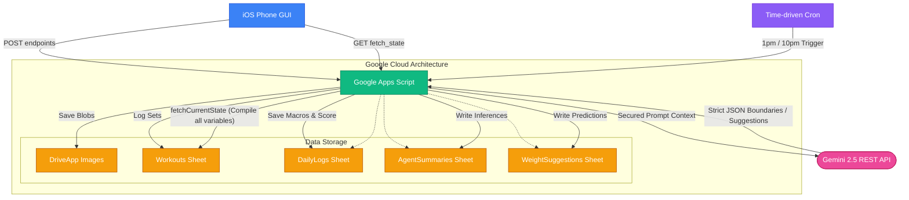

# rba | fit

Welcome to your personalized, serverless, modular fitness tracking system. This application was architected to give you complete authoritative control over your data without subscribing to bloated third-party services.

## Architecture

This project is broken into two distinct domains:

### 1. The Client UI (Front End)
A simple, mobile-first, and highly optimized local HTML/JS/CSS structure.
- **`index.html`**: The document skeleton and framework.
- **`js/data.js`**: Contains your structural 12-week workout plans, dynamic warm-up constants, and exercise group mapping (`EG`) logic.
- **`js/storage.js`**: Connects your local HTML directly to Google infrastructure and manages local caching parameters (`localStorage`).
- **`js/app.js`**: The monolithic rendering cycle engine. Handles Overviews, RPE selection rows, logic filtering, and the AI Home Dashboard modules.
- **`css/styles.css`**: Styling elements powered by a modern glassmorphism aesthetic and a sleek dark theme.

### 2. The Cloud Agent (Backend Serverless)
The backend leverages a **Google Apps Script** environment pointing straight into your personal Google Drive and Google Sheets.
- It parses raw payloads sent from your phone seamlessly via `doPost()`.
- Uploads images as unique data blobs to `DriveApp`.
- Handles Time-Driven Triggers (cron jobs) running the isolated `Midday` (1 PM) and `End of Day` (10 PM) background assessments against your `nutrition`, `smart_suggestions`, and `summaries` Gemini endpoints.

### 3. Serverless Data Flow

## Setup Instructions

1. **Host Frontend**: Clone this repo and serve `index.html` via **GitHub Pages**, locally, or through an iOS shortcut file-launcher. 
2. **Launch Backend**: Create a fresh Google Apps Script. Open `google_app_script.md`, copy its contents, and deploy it as a web app. Run `doPost` to construct your spreadsheet clusters natively!
3. **Configure Cron**: Use the left-sidebar inside Google Apps Script to assign Triggers (`runMiddayAgent` & `runEODAgent`) manually at 1PM and 10PM.

*Built exclusively for RBA.*
